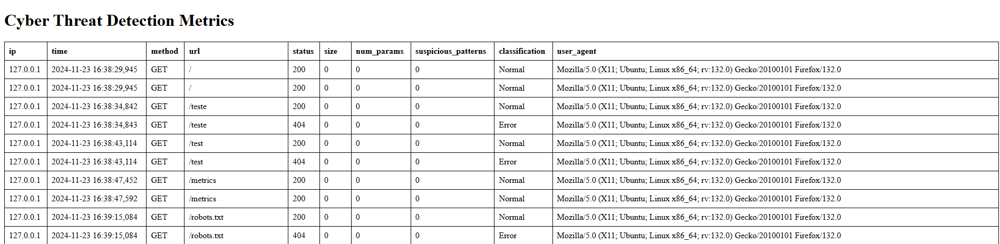

# Cyber Threat Detection System

Este repositório contém um sistema para análise e detecção de ameaças cibernéticas baseado em logs de acesso HTTP. Ele oferece uma interface web para visualizar métricas e realizar análises detalhadas, utilizando técnicas para identificar padrões maliciosos em requisições.

## 🗂️Table of Contents

- [Funcionalidades Principais](#funcionalidades-principais)
- [Instalação](#instalação)
- [Uso](#uso)
- [Exemplo de visualização](#exemplo-de-visualização)
- [Autores](#autores)

## Funcionalidades Principais

* 🔍**Análise de Logs HTTP**: Processamento de arquivos de log no formato Apache para extrair informações úteis, como IP, status HTTP, método, URL e mais.
* ⚠️**Detecção de Padrões Suspeitos**: Identificação de possíveis ameaças, como tentativas de injeção SQL, XSS e traversal directory.
* 📊**Interface Web**: Visualização de métricas e classificações de requisições através de uma aplicação Flask.
* 📉**Remoção de Outliers**: Filtro estatístico para eliminar valores fora do padrão.
* 📂**Exportação de Dados**: Salva resultados processados em arquivos CSV para análises posteriores.

## Instalação

1. Clone o repositório:

    ```bash
    git clone https://github.com/Joao-pedrosantos/TecHackerProjeto
    cd TecHackerProjeto
    ```

2. Instale as dependências:

    ```bash
    pip install -r requirements.txt
    ```

3. Execute a aplicação:

    ```bash
    python3 app.py
    ```

4. Acesse a interface web:
    
    ``` 
    http://localhost:5000
    ```

## Uso

Interface Web: Acesse /metrics para visualizar as métricas.
```
http://localhost:5000/metrics
```

### 🛠️ Gerando um Log de Teste

Para testar o sistema, você pode gerar uma entrada de log com uma requisição HTTP simples. Temos um exemplo de como fazer isso utilizando o cURL:

```bash
curl -X GET "http://localhost:5000/test"
```

## Exemplo de visualização

Ao acessar a interface web, você verá a seguinte tela:




## Autores

- [João Pedro Santos](https://github.com/Joao-pedrosantos)
- [Matheus Castellucci](https://github.com/MatheusCastellucci) 
- [Rodrigo Medeiros](https://github.com/rodme02)